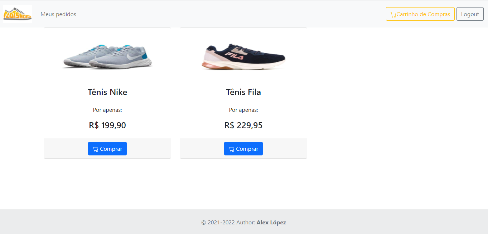

# LojaApp

> Aplicativo web de uma loja de tênis. Frontend desenvolvido utilizando [Angular](https://angular.io/) e estilizado com [Bootstrap 5](https://getbootstrap.com/). Utiliza como backend à [LojaAPI](https://github.com/lop19029/Loja-API).

### Funções

Este projeto ainda esta em desenvolvimento. Algumas das funcionalidades disponiveis são:

- [x] Validação de CPF.
- [x] Login de usuario na API utilizando JWT.
- [x] Proteção das rotas contra usuarios não autenticados.
- [x] Display de produtos disponiveis no banco de dados.
- [ ] Adicionar produtos ao carrinho de compras.
- [ ] Exibição de detalhes do carrinho de compras e produtos.
- [ ] Executar e salvar ordem de compra no banco de dados.
- [ ] Display dos pedidos do usuario.

## 💻 Pré-requisitos

Antes de começar, verifique se você atendeu aos seguintes requisitos:

* [Angular CLI](https://github.com/angular/angular-cli) versão 13.1.3

## 🚀 Instação

Basta clonar o projeto

## ☕ Usando o projeto

### Development server

Execute `ng serve` para acessar o servidor de desenvolvimento. No seu navegador, vai à `http://localhost:4200/`.

Para fins de teste, utilize um dos usuarios padrão entrar na conta:

**ADMIN**:
* CPF: 48067379092
* Senha: Gft2022

**USER**:
* CPF: 12281159078
* Senha: Gft2022

---
**IMPORTANTE**

É preciso que o backend esteja rodando na porta 8081 do seu computador. Caso contrario, varias funcionalidades podem se ver afetadas.

---

## 📝 Creditos

Esse projeto foi desenvolvido por [Alex López](https://github.com/lop19029). como parte do programa Starter da  [GFT](https://www.gft.com/br/pt).
